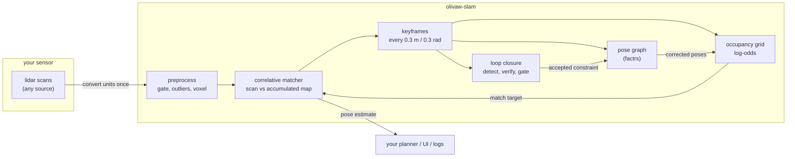
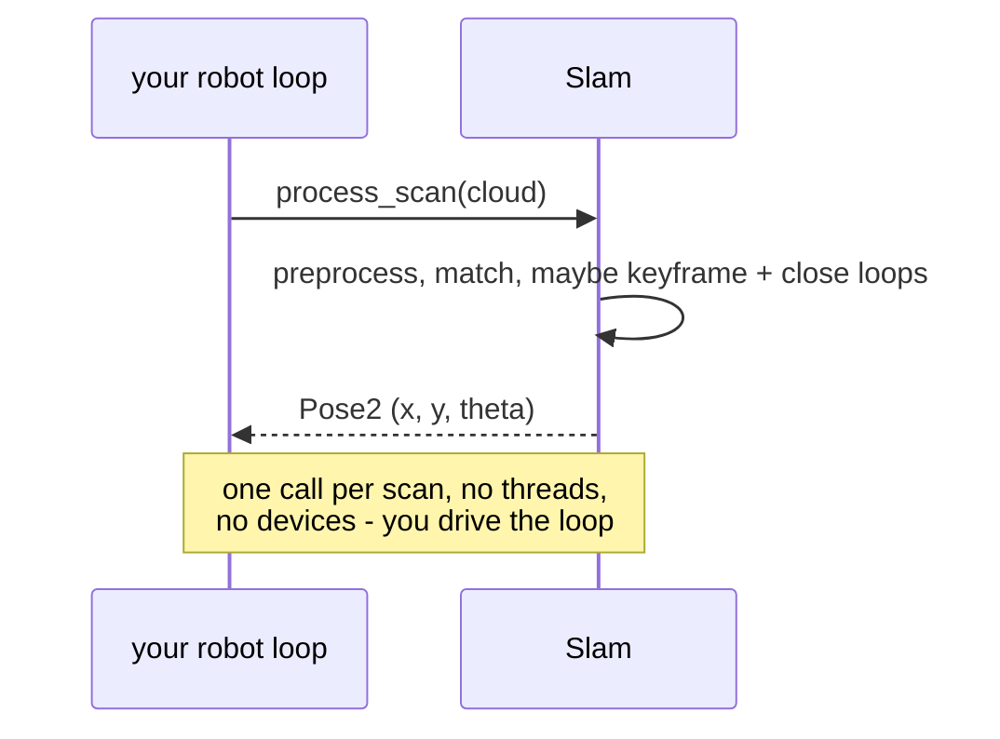

# olivaw-slam

2D lidar SLAM in pure Rust. No ROS2, no C++ dependencies, no distro lock-in.

Part of [Project Olivaw](https://github.com/Project-Olivaw) — tools and examples
for robotics in Rust. Architecturally equivalent to what `slam_toolbox` does
inside ROS2, but as a plain Rust library: it runs on macOS, Linux, and anything
else Rust targets, and cross-compiles to a Raspberry Pi or Jetson with
`cargo build --target aarch64-unknown-linux-gnu`.

Feed it lidar scans (from [`olivaw-lidar`](../olivaw-lidar) or any other
source); it produces a consistent occupancy-grid map and a pose estimate.

## How it works



The cycle on the right is the core idea: scans are matched against the
accumulated map (not the previous scan), so drift does not compound; accepted
loop closures re-optimize the pose graph and the map is rebuilt from the
corrected poses — the map heals itself.



Full design docs, algorithm explanations, pitfalls, and the roadmap live in
[documentation/](documentation/README.md).

## Quick start: live SLAM with a SLAMTEC C1

Plug the C1 into USB, install the rerun viewer once
(`uv tool install rerun-sdk`), then:

```sh
cargo run --release --example slam_live --features "viz serialize" -- --seconds 180
```

The port is auto-detected. Walk the lidar around (level, slow walking pace,
smooth turns) and watch the map, trajectory, and live scan build in the
viewer at sensor rate (~30 ms per scan against the C1's ~120 ms scan period).
Walk a closed circuit back to the start and you will see the loop-closure
counter tick up as the map snaps into global consistency. On exit you get:

- `live_map.pgm` + `live_map.yaml` — the map in standard `map_server` format
- `live_map.olivaw` — the full SLAM state, reloadable with `Slam::load`

## Record now, SLAM later

Recorded data is how the algorithms here are actually developed and debugged —
a recording is repeatable, a live run is not. Capture the raw byte stream with
olivaw-lidar, then replay it through SLAM as many times as you like:

```sh
# 1. Record (~2 min at the C1's ~4.7 kHz ≈ 600k nodes):
cd ../olivaw-lidar
cargo run --release --example record -- --out ~/lidar-recordings --nodes 600000 --seconds 130

# 2. Replay through the full pipeline, with visualization:
cd ../olivaw-slam
cargo run --release --example slam_from_recording --features "viz serialize" -- \
    ~/lidar-recordings/c1_scan_1000_nodes.bin my_house
```

Keep good recordings — they make permanent regression fixtures.

## All examples

Every example runs with `--save out.rrd` instead of a live viewer window
(inspect later with `rerun out.rrd`), and defaults to the committed fixture so
a stranger can run it with zero setup.

| example | what it shows |
|---|---|
| `slam_live` | Real-time SLAM from a plugged-in C1: map, trajectory, loop closures, per-scan timing. |
| `slam_from_recording` | The same full pipeline on a recorded `.bin`; exports map + state. |
| `grid_from_recording` | Just the occupancy grid, scans integrated at identity pose — the Phase 1 building block. |
| `scan_matching_viz` | One correlative match: reference scan, query at its wrong guess, recovered alignment, and the score surface. The debugging instrument for matching problems. |

```sh
cargo run --release --example scan_matching_viz --features viz
```

## Using it in your robot

The library never spawns threads or opens devices — you drive the loop, which
is what makes it embeddable in anything: a plain binary, a dora-rs node, or a
future ROS2 bridge.

```rust,no_run
use olivaw_slam::{Slam, SlamConfig, ScanCloud, Point2};

let mut slam = Slam::new(SlamConfig::default())?;

loop {
    // 1. Get a scan from YOUR sensor source (driver, network, replay...).
    //    Convert to metres, x-forward/y-left, ONCE at this boundary:
    let points: Vec<Point2> = my_sensor_scan()
        .map(|(range_m, bearing_rad)| Point2::new(
            range_m * bearing_rad.cos(),
            range_m * bearing_rad.sin(),
        ))
        .collect();
    let cloud = ScanCloud::new(points, timestamp_ns);

    // 2. One call per scan. Everything happens inside: preprocessing,
    //    scan-to-map matching, keyframes, pose graph, loop closure.
    let pose = slam.process_scan(&cloud)?;

    // 3. Use the estimate — feed your planner, your UI, your logs.
    println!("robot at ({:.2}, {:.2}) heading {:.2} rad", pose.x, pose.y, pose.theta);
}
```

The day-two workflow — map once, then localize in the saved map (what a
production robot runs day to day):

```rust,no_run
use olivaw_slam::Slam;

// After a mapping session: slam.save("house.olivaw".as_ref())?;
let mut slam = Slam::load("house.olivaw".as_ref())?;
slam.set_localization_mode(true);   // the map is now frozen
// ... process_scan() as usual: poses update, the map never changes.
```

Every stage is also usable on its own — depend only on what you need:
`matcher::CorrelativeMatcher` (CSM per Olson 2009, no initial guess needed,
bounded runtime), `matcher::IcpMatcher`, `grid::OccupancyGrid`,
`graph::PoseGraph` (backed by [factrs](https://docs.rs/factrs)),
`loop_closure::LoopDetector`. Every threshold in every stage is a documented
config field with a sane default — nothing is hardcoded.

## Status

All phases of the 0.1.0 plan are implemented and tested:

- CSM recovers synthetic transforms to < 1 cm / 0.5° (tested).
- Pose graph reproduces the published `M3500.g2o` optimum (χ² ≈ 138, tested).
- On a synthetic noisy circuit with zero odometry: ~0.75 m of accumulated
  drift is corrected to **2.3 cm** final error by loop closure (tested).
- Maps save and reload with bit-identical geometry; localization mode tracks
  in a frozen map without modifying it (tested).
- Verified on real hardware: a SLAMTEC C1 room capture produces a sharp map,
  and live SLAM runs at ~30 ms/scan (4× real-time headroom).
- `#![forbid(unsafe_code)]`, no `unwrap`/`panic!` in library code, clippy
  pedantic clean, criterion benchmarks for every hot path.

Known gaps, on purpose and tracked: no motion deskew yet (carry the sensor
smoothly), point-to-line ICP upgrade pending (CSM is the workhorse), and the
`slam_toolbox` oracle comparison needs a Docker/ROS2 session with a real
circuit recording.

## Features

| feature     | default | what it adds |
|-------------|---------|--------------|
| `std`       | yes     | (marker for future no_std work) |
| `parallel`  | no      | rayon-parallel CSM search |
| `serialize` | no      | `Slam::save`/`Slam::load`, serde on configs |
| `viz`       | no      | `OccupancyGrid::log_to_rerun` + the examples |

The deployable configuration (`parallel serialize`) is pure Rust all the way
down and cross-compiles to `aarch64-unknown-linux-gnu` out of the box; `viz`
(rerun) is development tooling.

## Units

**Metres and radians, everywhere, no exceptions.** Sensor drivers that report
millimetres/degrees (like `olivaw-lidar`) are converted once at the boundary —
see the examples. Angles are `(-π, π]`, CCW-positive, x-forward y-left frame.

## Documentation

The [documentation/](documentation/README.md) folder is the project's long-term
memory, written so a newcomer (or a future you, months away) can understand and
modify the system:

- [Overview & architecture](documentation/01-overview.md) and the
  [development history](documentation/02-development-history.md)
- Per-module deep dives: [core types](documentation/03-core-types.md),
  [preprocessing](documentation/04-preprocessing.md),
  [occupancy grid](documentation/05-occupancy-grid.md),
  [scan matching](documentation/06-scan-matching.md),
  [pose graph](documentation/07-pose-graph.md),
  [loop closure](documentation/08-loop-closure.md),
  [the orchestrator](documentation/09-slam-orchestrator.md)
- [Testing & benchmarks](documentation/10-testing-and-benchmarks.md),
  [pitfalls & lessons learned](documentation/11-pitfalls-and-lessons.md), and
  the [roadmap, including the honest slam_toolbox comparison](documentation/12-roadmap.md)

[CLAUDE.md](CLAUDE.md) remains the authoritative engineering spec the project
was built against.
