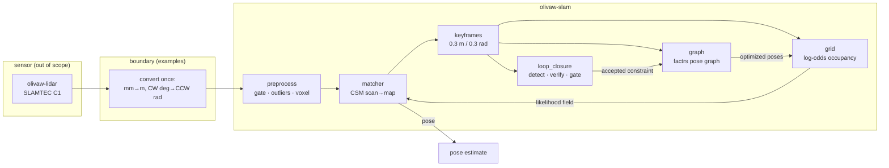
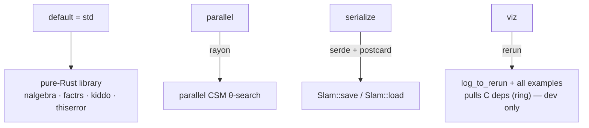

# 01 — Overview & architecture

## The thesis

SLAM and ROS2 are separate concerns that got welded together by history. Scan
matching, pose graphs, and loop closure have nothing to do with message
passing, TF trees, or Ubuntu versions. `olivaw-slam` separates them: a plain
Rust library, architecturally equivalent to `slam_toolbox`'s core, that

- runs anywhere Rust targets (macOS, Linux, cross-compiles to ARM boards),
- has zero `apt` dependencies and zero C/C++ in its deployable configuration,
- can be embedded in a binary, a dora-rs node, a WASM module — or bridged to
  ROS2 later *by a separate crate*, without ROS2 ever being a build dependency.

The accuracy target is deliberate: **a metrically usable map of a house or
small building, reliably** — not Cartographer-grade warehouse mapping.

## The pipeline

The critical cycle to understand: scans are matched **against the accumulated
grid** (not the previous scan), which stops incremental drift from
compounding; accepted loop closures re-optimize the graph, and the grid is
**rebuilt** from the corrected keyframe poses, which the matcher then matches
against. The map heals itself.

## Module map

| module | file(s) | role | usable standalone? |
|---|---|---|---|
| core types | `src/pose.rs`, `src/scan.rs` | `Pose2` (SE(2)), `Point2`, `ScanCloud`, `normalize_angle` | yes |
| `preprocess` | `src/preprocess/mod.rs` | scan cleanup at sensor rate, zero steady-state allocation | yes |
| `grid` | `src/grid/` | log-odds occupancy grid, Bresenham ray casting, PGM+YAML export | yes |
| `matcher` | `src/matcher/` | ICP, correlative (CSM), scan-to-map; the `ScanMatcher` trait | yes |
| `graph` | `src/graph/mod.rs` | pose graph on factrs; all factrs conventions quarantined here | yes |
| `loop_closure` | `src/loop_closure/mod.rs` | candidate search + CSM verification (gating lives in `slam.rs`) | yes |
| orchestrator | `src/slam.rs` | the `Slam` type: composes everything, owns save/load and localization | — |
| support | `src/error.rs`, `src/convert.rs` | `SlamError`; the crate's single audited float→int conversion | — |

## Feature flags

The deployable configuration is `--features "parallel serialize"`: pure Rust
all the way down, cross-compiles to `aarch64-unknown-linux-gnu` out of the
box. `viz` is development tooling and breaks cross-compilation (rerun's
dependency tree contains C code) — that is by design, not an accident.

## Design invariants (violate these and things break subtly)

1. **Units**: metres and radians everywhere inside the crate. `f64` for poses
   (error accumulates), `f32` for grid cells (memory-bound).
2. **Frames**: x-forward, y-left, right-handed, angles CCW-positive in
   `(-π, π]`. The lidar reports **clockwise** angles — the boundary conversion
   negates y. Getting this wrong produces mirror-image maps.
3. **The library never spawns threads, opens devices, or hides a loop.** The
   caller drives `process_scan` — that is what makes it embeddable.
4. **Keyframes and graph nodes are created in lockstep**; keyframe index ==
   node index. `slam.rs` relies on this.
5. **The grid is derived state**: it can always be rebuilt deterministically
   from keyframes. This is why saving state doesn't store the grid, and why
   loop closure can just rebuild it.
