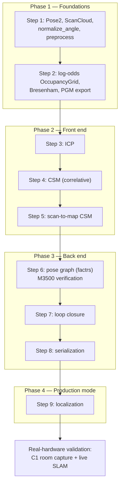

# 02 — Development history

The project was built strictly in the order defined by [CLAUDE.md](../CLAUDE.md)'s
implementation plan: each step shipped with its own tests and visualization
before the next began. This file records what happened at each step and the
decisions that were made along the way — including the ones that deviated from
the original spec, and why.

## Phase 1 — Foundations

**Step 1** delivered `Pose2`/`Point2`/`ScanCloud`, the single `normalize_angle`
function (every pose operation routes through it), and the `Preprocessor` with
reusable scratch buffers. Property tests (proptest) proved the SE(2) algebra:
compose/inverse round-trips, identity, associativity, theta always in
`(-pi, pi]`.

**Step 2** delivered the fixed-size log-odds `OccupancyGrid` with
Liang-Barsky beam clipping and endpoint-excluding Bresenham traversal.
The Phase 1 milestone (`examples/grid_from_recording.rs`) replayed a recording
and built a grid at identity pose in rerun.

Decisions made here that still matter:

- **Fixed-size grid, not auto-growing.** CLAUDE.md earmarks submaps as the
  future growth mechanism, so grow-and-copy logic would have been throwaway.
  Fixed dims also make denial-of-service validation a one-time constructor
  check and keep `integrate_scan` infallible.
- **`floor_to_i64` in `src/convert.rs`** is the crate's only float-to-integer
  cast, validated then exact. Everything that discretizes coordinates goes
  through it.
- **rerun moved behind a `viz` feature.** CLAUDE.md sketched
  `OccupancyGrid::log_to_rerun` as a library method but listed rerun as a
  dev-dependency — incompatible. An optional dependency behind a feature
  honors both intents.
- **kiddo, rayon, factrs were deliberately deferred** until the step that
  needed them, so no phase carried dead dependencies.

## Phase 2 — The front end

**Step 3 (ICP)**: point-to-point with k-d tree correspondences and Huber
weighting. Two lessons surfaced immediately: kiddo's default bucket size
panics on axis-aligned walls (see [11 — Pitfalls](11-pitfalls-and-lessons.md)),
and point-to-point ICP carries an inherent ~1.5 cm bias when two scans sample
different physical points along the same surface. That bias is why point-to-line
exists as the planned upgrade — and why CSM, not ICP, is the system's workhorse.

**Step 4 (CSM)**: the important one. Two-level search (block-max-pooled coarse
stage, bilinear fine stage) over a chamfer-distance likelihood field, plus a
**parabolic sub-step refinement** that was added when the accuracy test landed
exactly 1 cm off — quantization at the search step. With refinement, CSM meets
the 0.1.0 bar: transforms recovered to under 1 cm / 0.5 degrees with no
initial guess.

**Step 5 (scan-to-map)**: the same CSM search, fed by occupied grid cells
instead of a reference scan. Accuracy against a map is bounded by the grid
resolution (roughly 0.05 m) because occupied evidence is quantized to cell
centres — a fact the tests encode explicitly.

## Phase 3 — The back end

**Step 6 (pose graph)**: a thin wrapper over factrs that stores nodes/edges
itself and rebuilds the factrs problem on every `optimize` call. At house
scale the rebuild costs microseconds, and it makes speculative optimization
(the loop-closure gate) trivial. All factrs conventions — nalgebra 0.33
types, rotation-first `[theta, x, y]` ordering, `SE2::new(theta, x, y)` — are
quarantined inside `src/graph/mod.rs`. Verified against **M3500**: converged
objective 68.96, matching the published chi-squared of ~138 under factrs's
one-half convention, in 0.08 seconds.

**Step 7 (loop closure)**: three separable stages — radius+separation
candidate search, wide-window CSM verification, and a chi-squared residual
gate applied after optimizing a **clone** of the graph, so a rejected
constraint leaves no trace. The end-to-end circuit test walks a synthetic
ring corridor with noisy scans and zero odometry: about 0.75 m of accumulated
drift, four accepted loop closures, 2.3 cm final error.

**Step 8 (serialization)**: magic-plus-version header, postcard body. The
grid is deliberately **not** stored — rebuilding it from keyframes is
deterministic, and the round-trip test asserts bit-identical cells.

## Phase 4 — Localization

`Slam::load` plus `set_localization_mode(true)`: scan-to-map tracking against
a frozen map, verified to leave the map untouched cell-for-cell and to stay
consistent with the map frame to ~6 cm. A deliberate simplification: no
rolling-window graph smoothing, because without an odometry input the
smoother's between-edges would be perfectly correlated with the scan-to-map
priors and add nothing. Revisit when odometry arrives.

## Real-hardware validation

With all phases green on synthetic data, the system met a real SLAMTEC C1:

- A ~16 s desk capture (75,008 nodes, ~160 rotations) replayed through
  `slam_from_recording` produced a sharp, recognizable room map on the first
  attempt — walls crisp, free space carved, doorway visible — while tracking
  ~60 degrees of physical device rotation through 9 keyframes.
- `examples/slam_live.rs` (written for this occasion) ran the full pipeline
  live at ~30 ms per scan against the C1's ~120 ms scan period, with
  sub-centimetre pose jitter on a stationary sensor.

## Verification status at time of writing

72 tests across 7 suites, all passing; clippy pedantic clean across all
targets and features; zero `unsafe`; no `unwrap`/`panic!` in library code;
cross-compiles to `aarch64-unknown-linux-gnu` without `viz`. Benchmarks:
preprocess ~54 us, grid integration ~54 us, ICP ~110 us, CSM ~20 ms.
