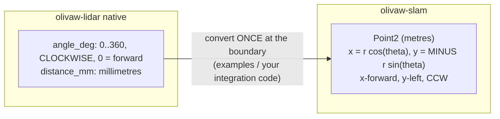

# 03 — Core types & conventions

Everything in this crate rests on a handful of contracts. Half of all robotics
bugs are unit or frame confusion; this file is the antidote.

## Units and frames

| quantity | unit | type | why |
|---|---|---|---|
| distance | metres | `f64` (poses), `f32` (grid cells) | poses accumulate error; cells are memory-bound |
| angle | radians, normalized to `(-pi, pi]` | `f64` | CCW-positive |
| time | nanoseconds since an arbitrary session epoch | `u64` | `std::time::Instant` has no epoch; see below |

Frame convention: **x forward, y left, right-handed, angles counter-clockwise
positive.** This matches REP-103 (ROS convention) on purpose so a future
bridge is a no-op frame-wise.



The y-negation exists because the lidar's angles increase clockwise. Forget it
and you get a mirror-image map that looks almost right — the worst kind of
wrong. `olivaw_lidar::Scan::to_cartesian()` already applies it; if you consume
raw `Point { angle_deg, distance_mm }` yourself, you must.

## `Pose2` — SE(2) (`src/pose.rs`)

```text
compose:  self followed by other, in self's frame
          x' = x + cos(t)*ox - sin(t)*oy
          y' = y + sin(t)*ox + cos(t)*oy
          t' = normalize(t + ot)
inverse:  the pose that composes with self to identity
between:  self.inverse().compose(other)  — "other as seen from self"
```

Key facts:

- `Pose2 { x, y, theta }` with **public fields** — it is message-shaped by
  design (ROS2-bridge friendly). `Pose2::new` normalizes theta; if you write
  the field directly, normalization is on you.
- Every operation re-normalizes theta through `normalize_angle` — the
  invariant lives in exactly one function.
- `transform_point` maps a point from the pose's frame to the world frame.
- `to_isometry` bridges to nalgebra when you need matrix form.

## `normalize_angle` — the single angle-wrapping function

Maps any angle into the half-open interval `(-pi, pi]`, with the boundary on
the positive side: `+pi -> pi`, `-pi -> pi`, `+-2pi -> 0`, `+-3pi -> pi`. NaN
propagates. It is `#[inline]`, called millions of times, and unit-tested at
every boundary. **Never write a second angle-wrapping expression anywhere** —
angle bugs produce maps that look almost right.

Property tests (`tests/pose_properties.rs`) prove the algebra over random
poses: compose/inverse round-trips both orders, identity neutrality,
associativity, `a.compose(a.between(b)) == b`, theta always in range, and
agreement with nalgebra's `Isometry2`.

## `ScanCloud` (`src/scan.rs`)

A scan in the **sensor frame**, already Cartesian, already metres:

- `points: Vec<Point2>` and `timestamp_ns: u64`, both public — deliberately a
  plain data carrier with no behavior beyond `len`/`is_empty`, so a bridge
  crate can convert it to/from middleware messages trivially.
- `timestamp_ns` counts from an arbitrary monotonic session epoch, usually
  the first scan of a session. This is because `olivaw-lidar` stamps scans
  with `std::time::Instant`, which has no wall-clock epoch. Do not compare
  timestamps across sessions.

## `SlamError` (`src/error.rs`)

One `#[non_exhaustive]` error enum for the whole crate. The philosophy:

- **Hard failures are `Err`**: degenerate input, singular math, oversized
  input (denial-of-service guards), solver failure, corrupt state files.
- **Poor quality is not an error**: a weak scan match returns `Ok` with
  `converged = false` and a low score; the caller decides. This keeps the
  online loop alive through bad moments instead of crashing the robot.

## `floor_to_i64` (`src/convert.rs`)

The crate forbids ad-hoc lossy `as` casts. The single sanctioned
float-to-integer conversion validates finiteness and the 2^53
exactly-representable range, then floors. Grid cell math, voxel keys, and
CSM step counts all route through it. If you need a float-to-int conversion
anywhere, use this or extend this file — do not scatter casts.
