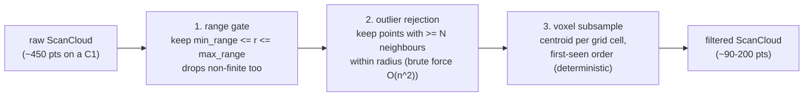

# 04 — Preprocessing

`src/preprocess/mod.rs`. Raw lidar returns are noisy: sensor-cowl echoes at
close range, isolated speckle points, and far more points than the matcher
needs. The `Preprocessor` cleans a `ScanCloud` in a fixed three-stage
pipeline, at sensor rate, with **zero steady-state allocation** (scratch
buffers live in the struct and are cleared, not reallocated).

## Why this order

Outlier rejection runs **before** subsampling so neighbour counts reflect the
true point density; subsampled data would make legitimate surfaces look
sparse. The range gate runs first because it is the cheapest and removes the
points that would poison the other stages (a 0-range echo has infinite
neighbours at distance 0).

## Configuration (`PreprocessConfig`)

| field | default | meaning |
|---|---|---|
| `min_range_m` | 0.15 | closer returns are echoes off the sensor housing |
| `max_range_m` | 12.0 | the C1's rated maximum |
| `voxel_size_m` | 0.05 | matches the default grid resolution |
| `outlier_radius_m` | 0.10 | neighbourhood radius |
| `outlier_min_neighbors` | 2 | 0 disables outlier rejection |
| `max_input_points` | 8192 | denial-of-service guard; errors, never allocates unbounded |

## Implementation notes

- **Brute-force O(n^2) outlier rejection is deliberate.** At ~450 points a
  full pass is ~10^5 squared-distance comparisons — microseconds — and
  building a k-d tree per scan would cost comparable time while adding a
  dependency this stage does not need. Revisit only if input sizes grow 10x.
- **Determinism**: the voxel stage uses a HashMap only as an index; output
  order is the first-seen cell order, so results are reproducible across runs
  and platforms. Never iterate a HashMap into output.
- Non-finite points fail the range-gate comparison naturally (NaN compares
  false) and are dropped without a special case.
- The whole pipeline is ~54 microseconds per 450-point scan
  (`benches/preprocess.rs`).

## Known pitfall: long-range culling

With the C1's ~1 degree angular spacing, adjacent returns on a wall are more
than `outlier_radius_m` (0.10 m) apart beyond ~5.8 m range — so sparse
long-range wall points get culled as "outliers" even when they are real. In a
house (ranges mostly under 6 m) this is harmless; in large rooms it visibly
thins distant walls. Fixes, in order of effort: raise `outlier_radius_m`,
scale the radius with range, or make `outlier_min_neighbors` range-dependent.
See [12 — Roadmap](12-roadmap.md).

## What is missing (by design, for now)

CLAUDE.md's preprocess stage lists **deskew** — compensating for sensor motion
during one revolution — which is not implemented. At walking pace the C1's
~120 ms revolution smears points by a few centimetres; at robot speeds or fast
turns it matters a lot. This is the top item on the roadmap and the reason the
examples tell you to carry the lidar slowly.
