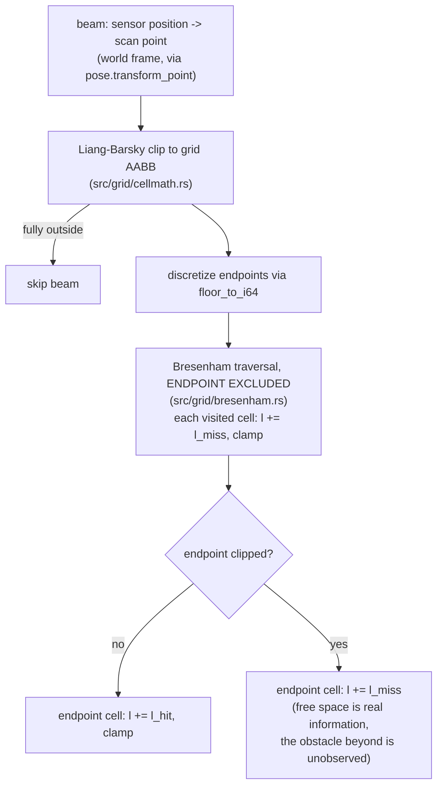

# 05 — Occupancy grid

`src/grid/` — the map representation: a fixed-size, row-major array of
log-odds occupancy values, updated by ray casting.

## Log-odds in one paragraph

Each cell stores `l = log(p / (1 - p))` as an `f32`, starting at 0 (p = 0.5,
unknown). A beam **hit** adds `l_hit` (default 0.85, i.e. p_hit = 0.7); each
cell the beam **passes through** adds `l_miss` (default -0.4, p_miss = 0.4).
Values clamp to `[l_min, l_max]` (defaults -2.0, +3.5) so cells stay
responsive to change: a wall saturates after ~5 hits and clears after ~9
misses. Defaults follow the inverse sensor model in Thrun, Burgard & Fox,
*Probabilistic Robotics* ch. 9; Cartographer's gentler 0.55/0.49 is noted in
the config docs as an alternative worth trying.

## The update path

Two details here prevent classic bugs:

1. **Bresenham excludes the endpoint cell.** Including it would apply a miss
   and then a hit to the same cell every beam — the standard occupancy-grid
   mistake that washes walls out.
2. **Clipping happens in world coordinates before discretization**, and the
   grid's clip box is shrunk by a sliver of a cell so a beam clipped exactly
   to the boundary never discretizes one cell out of range.

`integrate_scan` is infallible by design: all fallibility (dimension
validation, the `max_cells` denial-of-service guard via `checked_mul`) lives
in the constructor, and degenerate beams are skipped.

## Geometry decision: fixed-size grid

The grid has a configurable origin and extent (default 600x600 cells at
0.05 m = 30 m x 30 m centred on the start pose) and does **not** auto-grow.
Rationale: CLAUDE.md earmarks submaps as the future growth mechanism, so
grow-and-copy logic would be throwaway work; and fixed dims keep validation a
one-time check. If a map outgrows the default, raise `width_cells` /
`height_cells` / `origin` in `GridConfig` — the guard allows up to 16.7M cells
(64 MiB) by default.

## Coordinates

- `index = y * width + x`, row 0 at the origin corner (minimum y).
- `origin` is the world position of the **outer corner** of cell (0,0).
- Cell centres are at `origin + (i + 0.5) * resolution` — used by
  `occupied_cell_centres`, which feeds scan-to-map matching.
- PGM export writes top-row-first (image convention), so the file's first row
  is the grid's maximum-y row.

## Export

- `to_pgm(path)` — binary P5, `map_server` convention: occupied (p > 0.65) is
  0/black, free (p < 0.196) is 254, unknown 205.
- `export_map(stem)` — writes `<stem>.pgm` plus `<stem>.yaml` with resolution,
  origin, and thresholds: loadable by any `map_server`-compatible consumer,
  with ROS never involved on this side.
- `log_to_rerun` (feature `viz`) — grayscale image, occupied dark.

A rendering note that confuses people: a **single** observation of a cell
(one miss, l = -0.4, p = 0.4) still renders as *unknown* in the PGM because it
has not crossed the 0.196 free threshold. Sparse-looking exports from short
recordings are the thresholds being conservative, not the mapper failing.

## Performance

Integrating a 360-beam scan into the default grid costs ~54 microseconds
(`benches/grid.rs`). The traversal uses a closure visitor — zero per-ray
allocation — and `get_mut` for bounds-safe cell access (in-bounds is
guaranteed by clipping; the unreachable `None` arm is a silent skip, not a
panic).
