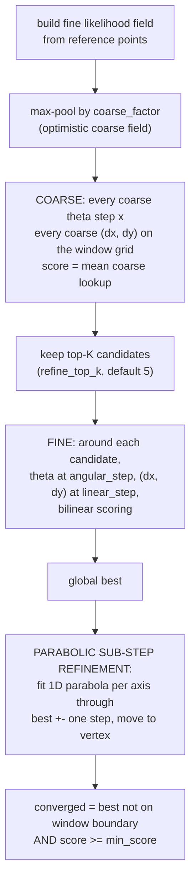

# 06 — Scan matching

`src/matcher/` — the front end. Given a reference (a scan or the map), a query
scan, and an initial guess, a matcher returns the pose of the query frame in
the reference frame, with covariance and a normalized score.

## The contract (`ScanMatcher`, `MatchResult`)

- `pose` — the estimate.
- `covariance` — 3x3 over `[x, y, theta]`; feeds pose-graph edge information.
- `score` — 0..1, higher is better. Comparable across CSM calls, less so
  between ICP and CSM.
- `converged` — the trust flag. **A weak match is `Ok` with
  `converged = false`, not an error**; only structurally impossible matches
  (no points, singular math) return `Err`. The caller (the `Slam` loop)
  decides what to do with weak results — usually: keep the previous pose and
  skip map updates.

## Matcher lineup

| matcher | needs a good guess? | runtime | role |
|---|---|---|---|
| `IcpMatcher` | yes (basin ~ feature spacing) | ~110 us, data-dependent | precision refinement when a guess exists |
| `CorrelativeMatcher` (CSM) | no | ~20 ms, bounded by window | the workhorse; robustness without odometry |
| `ScanToMapMatcher` | no | ~20 ms | CSM against the accumulated grid; kills drift |

CSM's real advantage over ICP is **runtime predictability**: its search is
bounded by the configured window regardless of the data. For a real-time loop
that matters more than raw speed.

## ICP (`src/matcher/icp.rs`)

Point-to-point Gauss-Newton: k-d tree correspondences (bucket size 512 — see
pitfall P2 in [11](11-pitfalls-and-lessons.md)), distance-gated, Huber-weighted.
Covariance is `sigma^2 * H^-1` from the weighted residuals.

Known limitation, measured: ~1.5 cm bias on clean ray-cast walls, because the
two scans sample *different physical points* on the same surface and
point-to-point pretends nearest-sample equals correspondence. Point-to-line
(match to the segment between neighbouring reference points) is the standard
fix and the planned upgrade.

## The likelihood field (`src/matcher/likelihood.rs`)

CSM does not compare point sets directly; it scores candidate poses against a
rasterized "how likely is a lidar return here" field:

1. Rasterize reference points into a grid (default 0.03 m).
2. Two-pass chamfer distance transform (orthogonal 1, diagonal sqrt(2) — a
   few percent error, far below the smoothing sigma).
3. Map distance to likelihood: `exp(-d^2 / (2 sigma^2))`, sigma 0.08 m.

Two lookups exist: nearest-cell (coarse stage) and bilinear (fine stage —
scores vary smoothly below raster resolution, which the sub-step refinement
depends on). `max_pool(factor)` produces the coarse field by block-max, which
is **optimistic**: a coarse score never underestimates the best fine score in
its block, so coarse-stage pruning never discards the true optimum.

## CSM (`src/matcher/csm.rs`)

After Olson 2009, "Real-Time Correlative Scan Matching", with a two-level
search plus one refinement of our own:

Notes that matter when tuning or debugging:

- **The parabolic refinement is not optional polish.** Without it, accuracy is
  quantized to `linear_step_m` / `angular_step_rad`; it was added when the
  1 cm accuracy test failed by exactly one step. With it, clean-data accuracy
  is sub-millimetre.
- **Covariance** comes from weighted second moments of the fine-stage score
  samples around the maximum (Olson's method, weights sharpened by `^8`).
  Corridors produce covariance stretched along the ambiguous direction —
  that is a feature: the pose graph then trusts that axis less. A floor at
  the quantization variance keeps the matrix positive definite.
- **Boundary maxima are flagged not-converged.** If the best score sits on the
  window edge, the true optimum is probably outside; trusting it corrupts the
  map. The circuit test that failed on instant 90-degree corner turns (P5 in
  the pitfalls file) is exactly this protection working.
- `CsmConfig::wide(radius)` is the loop-closure variant: big translation
  window, full-rotation theta window, coarser steps.
- The `parallel` feature switches the coarse theta loop and candidate
  refinement to rayon.

## Scan-to-map (`src/matcher/scan_to_map.rs`)

`ScanToMapMatcher` extracts occupied cell centres from the grid
(p > `occupied_threshold`, default 0.65), builds the same likelihood field
from them, and runs the same search. Matching against the *global map* rather
than the previous scan is what stops incremental drift from compounding.

One consequence to keep in mind: accuracy against a map is bounded by the grid
resolution (~0.05 m), because occupied evidence is quantized to cell centres.
The tests assert 4 cm tolerances here on purpose — do not "fix" them to 1 cm.

## Debugging matches

Run `cargo run --release --example scan_matching_viz --features viz`. It shows
the reference scan, the query at its wrong guess, the recovered alignment, and
the brute-force score surface around the optimum. Nearly every matching bug is
visible in that picture: multimodal surfaces (ambiguous geometry), flat ridges
(corridors), off-peak maxima (bad field sigma), mirror solutions (frame
convention errors).
