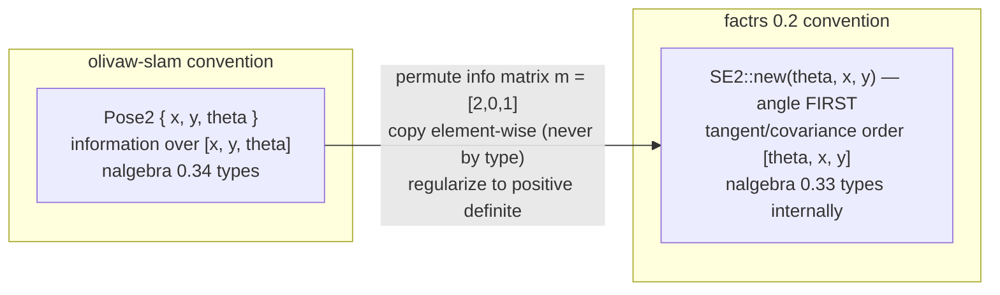

# 07 — Pose graph

`src/graph/mod.rs` — the back end. Nodes are keyframe poses; edges are
relative-pose constraints with information matrices from the matcher. The
optimization itself is delegated to [factrs](https://docs.rs/factrs) —
CLAUDE.md is explicit that pose-graph optimization is a solved problem and we
do not reimplement it.

## Design: own the data, rebuild the solver

`PoseGraph` stores its own `Vec<Pose2>` nodes, `Vec<GraphEdge>` edges, and
priors, and **rebuilds the factrs problem from scratch on every
`optimize()`**. This is unusual and deliberate:

- At house scale (hundreds of nodes) the rebuild costs microseconds; even
  M3500 (3500 nodes, 5453 edges) optimizes in 0.08 s.
- It makes **speculative optimization trivial**: loop-closure gating clones
  the `PoseGraph` (cheap — two Vecs), adds the candidate edge, optimizes the
  clone, and adopts or discards it. No incremental-solver bookkeeping, no
  factor removal API needed.
- Serialization falls out for free: saved state is just poses + edges, and
  `PoseGraph::from_parts` restores it.

If graphs ever grow to tens of thousands of nodes, revisit (factrs or an
iSAM2-style incremental backend); until then this is the simplest correct
thing.

## The factrs boundary — all conventions quarantined here

factrs has three conventions that differ from ours. Every one of them is
handled inside `graph/mod.rs` and nowhere else:

- `SE2::new(theta, x, y)` — angle first. Swap the order and everything is
  silently wrong.
- Information matrices are **permuted** from our `[x, y, theta]` to factrs's
  rotation-first `[theta, x, y]` (`information_to_noise`).
- factrs uses nalgebra 0.33 internally while we use 0.34: same type names,
  incompatible types. Matrices cross the boundary **element by element**.
- factrs Choleskys the information matrix and panics if it is not positive
  definite — so we check PD on our side first and regularize with a growing
  diagonal before handing it over. A panic in the backend would take the
  robot down.
- The `assign_symbols!` macro must be *imported* (`use factrs::assign_symbols`)
  because it calls itself unqualified; path-invoking it fails to compile.

`BetweenResidual`'s measurement convention matches ours exactly: the edge
measurement is `from.between(to)`, i.e. the transform z with
`from compose z == to`.

## Gauge freedom and priors

A relative-constraint-only graph slides freely (any rigid transform of all
poses has equal cost). If the caller adds no explicit prior, `optimize`
anchors the first node with a strong prior automatically. Explicit priors
(`add_prior`) exist for localization-style problems where absolute
constraints are meaningful.

## Failure semantics

- Hitting the iteration cap still **adopts** the partially optimized estimate
  (`OptError::MaxIterations` carries the values) — standard online-SLAM
  behavior; a partial improvement beats none.
- `InvalidSystem` / `FailedToStep` return `SlamError::OptimizationFailed` and
  leave node poses untouched.
- Edges referencing missing nodes are caught at build time with a clear error.

## Verification: M3500

`tests/m3500.rs` parses the canonical benchmark with its own minimal g2o
reader (exercising our `PoseGraph` API, not factrs's loader), optimizes, and
checks the objective:

- initial (raw odometry): ~1,284,947
- converged: **68.96** — which is the published optimum: factrs uses the
  one-half convention (`0.5 * sum r^T Omega r`), and 2 x 68.96 = 137.9
  matches the chi-squared ~138 that GTSAM and g2o report.

The g2o `EDGE_SE2` information matrix is upper-triangular in `[x, y, theta]`
order — exactly our convention, so the parser passes it straight through and
the permutation happens once at the factrs boundary like everywhere else.

The fixture lives at `tests/fixtures/M3500.g2o` (712 KB, committed — the
test must not depend on the network).
