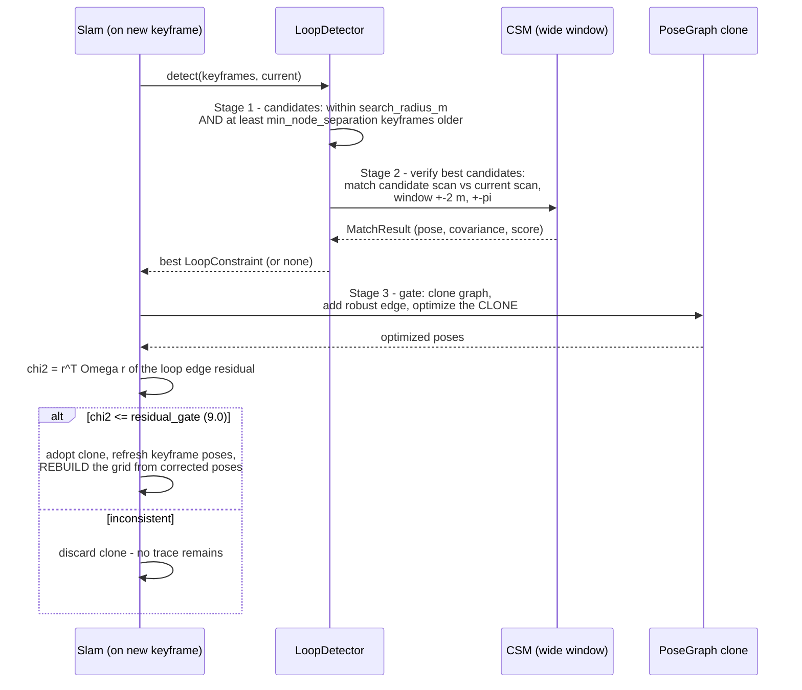

# 08 — Loop closure

`src/loop_closure/mod.rs` (detection) + the gating half in `src/slam.rs`.
This is the hardest part of SLAM and the one that produces the most
spectacular failures. The governing asymmetry, stated in CLAUDE.md and
enforced everywhere here:

> A missed loop closure costs accuracy. A false one **folds the map in half**.
> Every threshold errs conservative.

## The three stages

**Stage 1 — candidate search**: keyframes whose *estimated* position is within
`search_radius_m` (default 3.0) of the current pose but at least
`min_node_separation` (default 20) keyframes older. The separation is what
distinguishes "returned to a known place" from "have not left yet". Currently
a linear scan over keyframe positions — fine at house scale; a k-d tree is a
drop-in upgrade if keyframe counts grow.

**Stage 2 — verification**: wide-window CSM (`CsmConfig::wide`-style: +-2 m
translation, +-pi rotation, coarser steps) between the candidate's stored scan
and the current scan, seeded with the drifted relative-pose guess. Accept only
`converged` results with `score >= min_score` (default 0.6 — deliberately
high). The match covariance, inverted, becomes the constraint's information.

**Stage 3 — gating** (in `Slam::try_close_loop`): the constraint is added as a
**Huber-robust edge** to a *clone* of the pose graph; the clone is optimized;
then the loop edge's own residual under the optimized poses is tested:
`chi2 = r^T Omega r <= residual_gate` (default 9.0 — roughly the 97th
percentile of a 3-DoF chi-squared). Only then is the clone adopted. A rejected
constraint leaves zero trace — the clone is dropped.

## Why each safety layer exists

| layer | failure it prevents |
|---|---|
| high `min_score` | verifying against superficially similar geometry (two similar corners) |
| `converged` requirement | trusting a boundary maximum from a too-small window |
| Huber kernel on loop edges | one bad accepted constraint dragging the whole map instead of being down-weighted |
| chi-squared gate after optimizing a clone | constraints that match locally but are globally inconsistent with the rest of the graph |
| clone-and-discard | any rejected attempt polluting the real graph |

These are redundant on purpose. Loop closure is where redundancy is cheap and
recovery is not.

## After acceptance

Adopting a closure does three things in `slam.rs`: keyframe poses are
refreshed from the optimized graph, the current pose jumps to the corrected
last-keyframe pose, and **the grid is rebuilt from scratch** by re-integrating
every keyframe scan at its corrected pose. Rebuilding sounds expensive but is
tens of milliseconds at house scale, and it is the only way the *map* (not
just the trajectory) actually heals — the matcher immediately benefits because
it matches against the corrected map.

## Measured behavior

The end-to-end circuit test (`tests/slam_circuit.rs`) walks a synthetic ring
corridor (36 m, noisy scans, zero odometry): ~0.75 m of drift accumulates,
**four** loop closures are accepted near the revisit, and the final pose error
drops to **2.3 cm**. The unit tests additionally prove that a non-overlapping
scene does *not* verify (the false-positive case) and that candidate search
respects both radius and separation.

## Tuning guidance

- Symptom: loops never fire. Check `min_node_separation` against your keyframe
  density (20 keyframes at 0.3 m spacing = 6 m of travel minimum), then
  `search_radius_m` against your expected drift.
- Symptom: map folds or shears after a closure. Raise `min_score`, lower
  `residual_gate`, and look at the verification matches in rerun before
  anything else — a wrong closure is almost always visible as two scans that
  match well but are not the same place.
- Never disable the gate to "make loops work". If verification cannot pass,
  the candidate is not trustworthy; fix the drift or the matcher instead.
