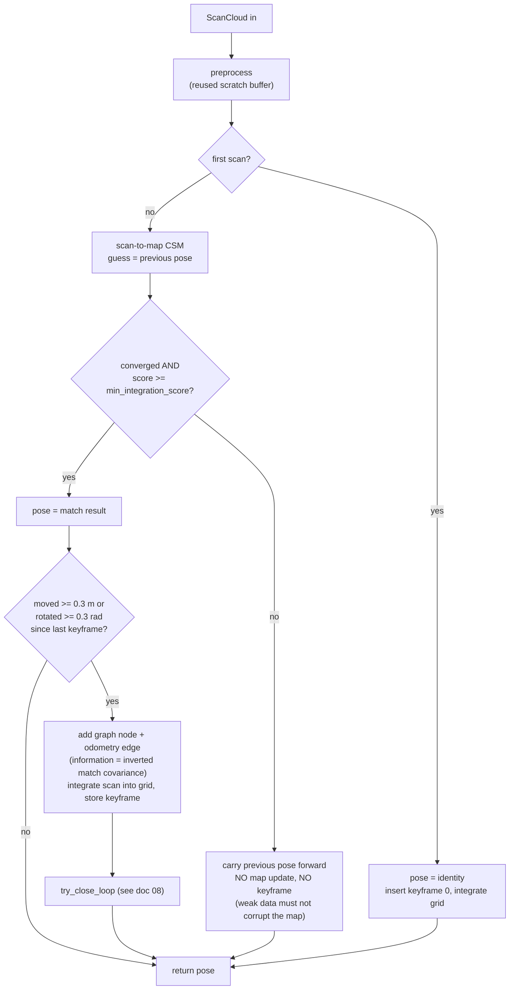
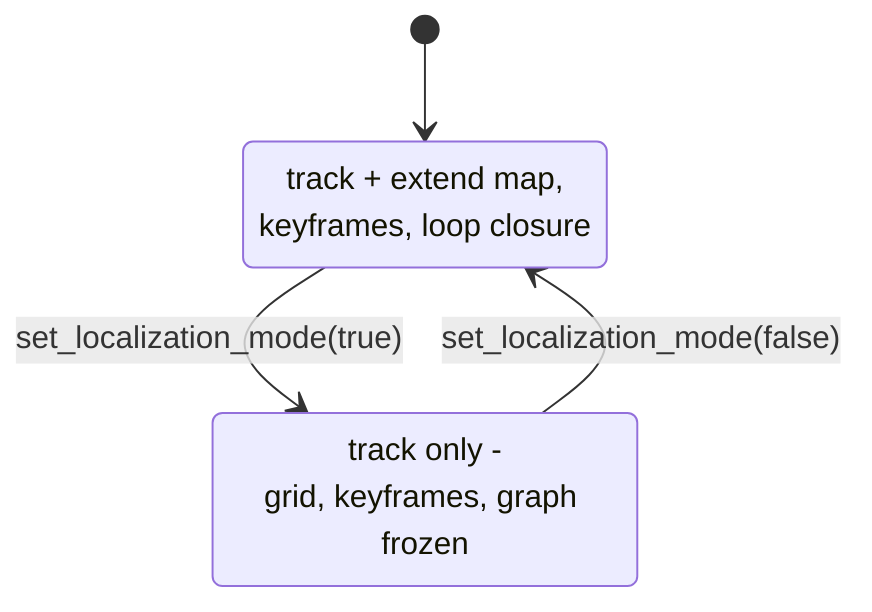

# 09 — The Slam orchestrator

`src/slam.rs` — the public face: one `Slam` type composing every stage behind
`process_scan`. The library never spawns threads or opens devices; the caller
drives the loop, which is what makes it embeddable in a plain binary, a
dora-rs node, or a future ROS2 bridge.

## `process_scan`, mapping mode



Decisions encoded in that flow:

- **Only keyframes are integrated into the grid.** This keeps the grid
  deterministically rebuildable from keyframes — the property that makes loop
  closure healing and grid-free serialization work. Non-keyframe scans still
  update the pose.
- **Weak matches carry the previous pose forward** instead of erroring or
  integrating garbage. An online loop must survive bad moments; the map must
  not pay for them.
- The keyframe policy (`0.3 m / 0.3 rad`) bounds graph growth by distance
  travelled, not time — a stationary robot creates one keyframe, ever.
- Keyframes and graph nodes are created in lockstep; **keyframe index equals
  node index** (`node()` in slam.rs relies on this invariant).

## Modes



Localization mode is scan-to-map tracking against the frozen grid — verified
to leave the map bit-identical. Deliberate simplification: no rolling-window
graph smoothing, because without an odometry source the smoother's
between-edges would be perfectly correlated with the scan-to-map results and
add nothing. When an odometry input exists (encoders, IMU), revisit — the
`PoseGraph::add_prior` API was built for exactly that.

## Persistence (`serialize` feature)

File layout: 8-byte magic `OLIVSLAM`, 4-byte little-endian version, then a
postcard-encoded `SlamState { config, keyframes, edges, pose, loops_closed }`.

The grid is **not** stored: rebuilding it from keyframes is deterministic, so
`load` reproduces bit-identical geometry from a fraction of the bytes (the
round-trip test asserts cell-for-cell equality). Corrupt or wrong-version
files return `SlamError::Serialization`, never panic.

Lifelong mapping workflow: map, `save`; later `load` and either continue
mapping (default) or `set_localization_mode(true)` to run a production robot
against the fixed map.

## Public API surface

```text
Slam::new(SlamConfig) -> Result<Slam>
slam.process_scan(&ScanCloud) -> Result<Pose2>     // the loop
slam.pose() / slam.grid() / slam.keyframes() / slam.graph()
slam.loops_closed()                                 // observability
slam.set_localization_mode(bool) / is_localization_mode()
slam.save(path) / Slam::load(path)                  // feature "serialize"
slam.grid().export_map(stem)                        // <stem>.pgm + .yaml
```

`SlamConfig` aggregates every stage's config (`preprocess`, `grid`, `matcher`,
`loop_closure`, `keyframes`) — one place to tune everything, serde-serializable
so a deployment can ship tuning as data.

## Timing budget (measured, release, M-series Mac)

| stage | cost | when |
|---|---|---|
| preprocess | ~54 us | every scan |
| scan-to-map CSM | ~20-30 ms | every scan |
| grid integration | ~54 us | keyframes only |
| graph optimize | ~us to ms | accepted loop closures only |
| grid rebuild | tens of ms | accepted loop closures only |

Against the C1's ~120 ms scan period the live pipeline runs at ~30 ms/scan —
four times real time. The dominant cost is CSM, whose window sizes are the
main tuning lever if you need more headroom.
