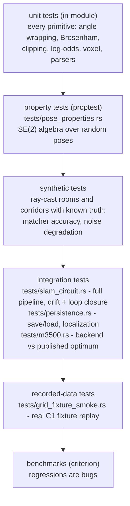

# 10 — Testing & benchmarks

No test requires hardware; CI can run everything. The strategy is layered so
that when something breaks, the failing layer tells you where to look.

## The layers



## Synthetic worlds

Two simulators exist, both deterministic (seeded LCG noise, no `rand`):

- `src/matcher/test_scenes.rs` (unit tests): a rectangular room with an
  off-centre inner box — asymmetric so it has no rotational ambiguity.
- `tests/common/mod.rs` (integration tests): a square **ring corridor**
  (outer 12 m room, inner 6 m block) decorated with six asymmetric pillars.
  The pillars are load-bearing: straight corridor sections are translationally
  ambiguous for a matcher, and the ring would otherwise be 90-degree
  rotationally symmetric — a false-loop-closure trap.

Both cast exact rays against wall segments, then add Gaussian-ish range noise
(Irwin-Hall sum of uniforms). The trajectory generator **turns in place at
corners** (0.2 rad steps) — instant 90-degree heading jumps between scans
exceed any matcher window and are physically unreal; forgetting this was a
real failure during development (pitfall P5).

## The headline integration test

`tests/slam_circuit.rs`: walk the ring corridor (36 m, 0.4 m steps, 1 cm range
noise, zero odometry), assert that at least one loop closure fires, final pose
error < 0.3 m (measured: 2.3 cm), worst mid-run error < 1 m, and the map has
real structure. Debug hook: set `OLIVAW_EXPORT_MAP=<stem>` to export the final
map for visual inspection.

## Fixtures (committed, tests never touch the network)

| fixture | what | used by |
|---|---|---|
| `../olivaw-lidar/tests/fixtures/c1_scan_1000_nodes.bin` | real C1 capture, ~1 rotation | `grid_fixture_smoke`, example defaults |
| `tests/fixtures/M3500.g2o` | canonical 3500-node pose-graph benchmark | `m3500` |

## Running everything

```sh
cargo test --all-features              # all suites (circuit test ~10 s in debug)
cargo test --all-features --release    # same, seconds total
cargo clippy --all-targets --all-features   # must be warning-free (pedantic on)
cargo bench                            # criterion, saves baselines in target/criterion
cargo check --target aarch64-unknown-linux-gnu --features "parallel serialize"
```

## Benchmark baselines (release, M-series Mac)

| bench | time | file |
|---|---|---|
| `preprocess_450pt_scan` | ~54 us | `benches/preprocess.rs` |
| `grid_integrate_360_beams_600x600` | ~54 us | `benches/grid.rs` |
| `icp_scan_to_scan_360pts` | ~110 us | `benches/matcher.rs` |
| `csm_scan_to_scan_360pts` | ~20 ms | `benches/matcher.rs` |
| `csm_scan_to_map_600x600` | ~20 ms | `benches/matcher.rs` |

A performance regression is a bug: criterion tracks baselines locally, and CI
should eventually gate on them (see roadmap).

## Conventions for test code

- Tests and examples may `unwrap` freely and index slices directly — both are
  forbidden in library code. The allowances are explicit
  (`#![allow(clippy::indexing_slicing)]` at test-file level) so the lints stay
  on for `src/`.
- Float assertions use `approx` (`assert_abs_diff_eq` / `assert_relative_eq`),
  never `==`.
- Tolerances encode physics, not wishes: 1 cm for CSM on clean data, 4 cm for
  scan-to-map (bounded by grid resolution), 2 cm for point-to-point ICP
  (sampling bias). Do not tighten them without changing the algorithm that
  justifies them.
- Benchmarks share the integration simulator via
  `#[path = "../tests/common/mod.rs"]` — one world, no copies.
